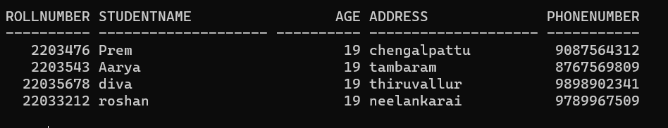
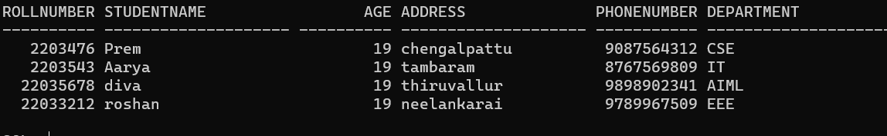
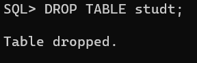
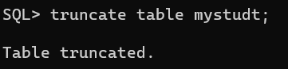
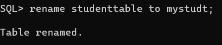

# EXP NO 1: DATA DEFINITION LANGUGE COMMANDS IN RDBMS

## AIM:
To create a student database and execute DDL queries using SQL.


## DDL (Data Definition Language)
<div align="justify">
DDL or Data Definition Language actually consists of the SQL commands that can be used to define the database schema. It simply deals with descriptions of the database schema and is used to create and modify the structure of database objects in the database. DDL is a set of SQL commands used to create, modify, and delete database structures but not data. These commands are normally not used by a general user, who should be accessing the database via an application.
</div>
 
## List of DDL commands: 
<div align="justify">
CREATE: This command is used to create the database or its objects (like table, index, function, views, store procedure, and triggers).
DROP: This command is used to delete objects from the database.
ALTER: This is used to alter the structure of the database.
TRUNCATE: This is used to remove all records from a table, including all spaces allocated for the records are removed.
RENAME: This is used to rename an object existing in the database.
</div>

## Query:
### 1) Create a table student with the following fieds rollno,name,age,address,phoneno.

## SQL QUERY:
```
create table studt(rollnumber int,studentname char(20),age int,address char(20),phonenumber int);
insert into studt values ('2203476','Prem','19','chengalpattu','9087564312');
insert into studt values ('2203543','Aarya','19','tambaram','8767569809');
insert into studt values ('22035678','diva','19','thiruvallur','9898902341');
insert into studt values ('22033212','roshan','19','neelankarai','9789967509');
 select * from studt;
 ```
## Output:



### 2) Change the above student table by adding another attribute department

### SQL QUERY: 
```
alter table studt add department char(20);
update studt set department='CSE' where rollnumber=2203476;
update studt set department='IT' where rollnumber=2203543;
update studt set department='AIML' where rollnumber=22035678;
update studt set department='EEE' where rollnumber=22033212;
select * from studt;
```

### OUTPUT:


### 3) Drop the student table
 
### SQL QUERY: 
```
DROP TABLE studt;
```


### OUTPUT:


### 4) Delete the student table using truncate keyword

### SQL QUERY: 
```
truncate table mystudt;
```
### OUTPUT:



### 5) Rename the student table to mystudent

### SQL QUERY: 
```
rename studt to mystudt;
```
### OUTPUT:


### Result:
Creating a student table and executing the DDL queries using SQL was successfully executed.
